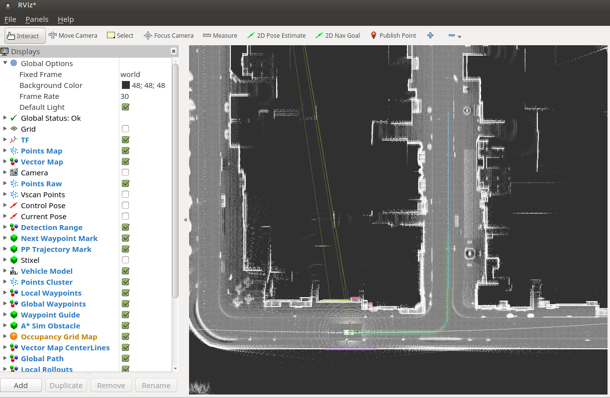
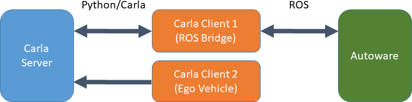

# Autoware in Carla
Integration of AutoWare AV software with the CARLA simulator

## Requirements

- ROS kinetic
- Autoware (tested with 1.9.1)
- PointCloud Map (see [Map Creation](docs/map_creation.md))


## Opens

- object detection (especially traffic lights)
- no compliance with traffic rules (due to missing vector map)
- vehicle control is not optimal yet (depending on vehicle)


## Setup

### Autoware

Setup/build Autoware as described here: https://github.com/CPFL/Autoware

### Carla

Download version of Carla from here: https://github.com/carla-simulator/carla


### Carla Autoware Bridge

The Carla Autoware Bridge is a ROS package. Therefore we create a catkin workspace (containing all relevant packages).
The generic Carla ROS bridge (https://github.com/carla-simulator/ros-bridge.git) is included as GIT submodule and 
has to be initialized ("git submodule update --init") and updated ("git submodule update").

    cd ~
    git lfs clone https://github.com/carla-simulator/carla-autoware.git
    cd carla-autoware
    git submodule update --init
    cd catkin_ws
    catkin_init_workspace src/
    cd src
    ln -s <path-to-autoware>/ros/src/msgs/autoware_msgs
    cd ..
    catkin_make

## Run

To run Autoware within Carla please use the following execution order:

1. Carla Server
2. Autoware Runtime Manager
3. Carla Autoware Bridge
4. Autoware Stack

You need two terminals:

    #Terminal 1

    #execute Carla
    SDL_VIDEODRIVER=offscreen <path-to-carla>/CarlaUE4.sh /Game/Carla/Maps/Town01 -benchmark -fps=10


    #Terminal 2

    export CARLA_AUTOWARE_ROOT=~/carla-autoware
    
    #execute Autoware (forks into background)
    <path-to-autoware>/ros/run

    #execute carla-autoware-bridge and carla-autoware-bridge
    export PYTHONPATH=<path-to-carla>/PythonAPI/carla-<version_and_arch>.egg:<path-to-carla>/PythonAPI/
    source $CARLA_AUTOWARE_ROOT/catkin_ws/devel/setup.bash
    #either execute a headless Carla client
    roslaunch carla_autoware_bridge carla_autoware_bridge.launch
    #or
    roslaunch carla_autoware_bridge carla_autoware_bridge_with_manual_control.launch

In Autoware Runtime Manager, select the customized launch files:


In Autoware Runtime Manager, start rviz and open the configuration <autoware-dir>/ros/src/.config/rviz/default.rviz

Now you can start the Autoware Stack by starting all launch files from top to bottom. The car should start moving.




A special camera is positioned behind the car to see the car and its environment.
You can subscribe to it via ```/carla/ego_vehicle/camera/rgb/viewFromBehind/image_color```.

# Design

The bridge contains two Carla Clients.

1. ROS Bridge - Monitors existing actors in Carla, publishes changes on ROS Topics
2. Ego Vehicle Client - Instantiation of the ego vehicle. Further communication to Carla is only done for visualization purposes.


