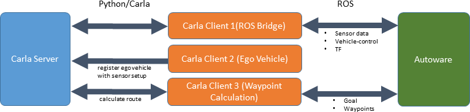

# Autoware in Carla
Integration of AutoWare AV software with the CARLA simulator


## Requirements

- ROS kinetic
- Autoware (tested with 1.12.0)
- CARLA 0.9.6

## Opens

- object detection (especially traffic lights)
- no compliance with traffic rules (due to missing vector map)

## Setup

### Autoware

Setup/build Autoware as described here: https://github.com/CPFL/Autoware

### Carla

    #download docker image (e.g. version 0.9.6)
    docker pull carlasim/carla:<carla-version>

    #extract the Carla Python API from the image
    cd ~
    mkdir carla-python
    docker run --rm --entrypoint tar carlasim/carla:<carla-version> cC /home/carla/PythonAPI . | tar xvC ~/carla-python


### Carla Autoware Bridge

The Carla Autoware Bridge contains two submodules: the Carla ROS bridge (https://github.com/carla-simulator/ros-bridge.git)
and point cloud maps for Carla Towns (https://bitbucket.org/carla-simulator/autoware-contents). Clone the repository and 
initialize the submodules:

[Warning]: Make sure you have git lfs(Large File System) installed. To install git lfs, please go to [git lfs documentation](https://github.com/git-lfs/git-lfs/wiki/Installation)

    cd ~
    git lfs clone https://github.com/carla-simulator/carla-autoware.git
    cd carla-autoware
    git submodule update --init

The Carla Autoware Bridge is a ROS package. Therefore we create a catkin workspace (containing all relevant packages).

    cd catkin_ws
    source <path-to-autoware>/install/setup.bash
    catkin_init_workspace src/

    # install dependencies
    rosdep update
    rosdep install -y --from-paths src --ignore-src --rosdistro $ROS_DISTRO

    catkin_make

## Run

To run Autoware within Carla please use the following execution order:

1. Carla Server
2. Autoware (including carla-ros-bridge and additional nodes)

You need two terminals:

    #Terminal 1

    #execute Carla
    #For details, please refer to the CARLA documentation
    nvidia-docker run -p 2000-2001:2000-2001 -it --rm carlasim/carla:<carla-version> ./CarlaUE4.sh


    #Terminal 2

    export CARLA_AUTOWARE_ROOT=~/carla-autoware/autoware_launch
    export CARLA_MAPS_PATH=~/carla-autoware/autoware_data/maps
    source $CARLA_AUTOWARE_ROOT/../catkin_ws/devel/setup.bash
    export PYTHONPATH=$PYTHONPATH:~/carla-python/carla/dist/carla-<carla-version>-py2.7-linux-x86_64.egg:~/carla-python/carla/
    roslaunch $CARLA_AUTOWARE_ROOT/devel.launch


### Multi machine setup

You can run Autoware and Carla on different machines. 
To let the carla autoware bridge connect to a remote Carla Server, execute roslaunch with the following parameters

    roslaunch host:=<hostname> port:=<port number> $CARLA_AUTOWARE_ROOT/devel.launch

## Ego Vehicle

The setup of the sensors is defined within [sensors.json](catkin_ws/src/carla_autoware_bridge/config/sensors.json).

[carla_ego_vehicle](https://github.com/carla-simulator/ros-bridge/tree/master/carla_ego_vehicle) reads the file and spawn the ego vehicle and the sensors.


## Development support

### Set Start/End of Route

When starting the carla_autoware_bridge a random spawn point and a fixed goal is used to calculate the route.

To override this, you can use RVIZ.


- selecting a Pose with '2D Pose Estimate' will delete the current ego_vehicle and respawn it at the specified position.
- selecting a Pose with '2D Nav Goal' will set a new goal within `carla_waypoint_publisher`.

#### Manual steering

Press `B` to be able to steer the ego vehicle within ROS manual control.

Internally, this is done by stopping the conversion from the Autoware control message to AckermannDrive within the node `vehiclecmd_to_ackermanndrive`. The relevant ros-topic is `/vehicle_control_manual_override`.

#### Use Carla Ground Truth Objects

You can skip the Autoware perception by using the ground truth objects from CARLA.
Therefore disable all relevant Autware perception nodes and execute:

```
rosrun carla_autoware_bridge carla_to_autoware_detected_objects
```

The objects get then published to `/tracked_objects`.

## Design

The bridge contains three Carla Clients.

1. ROS Bridge - Monitors existing actors in Carla, publishes changes on ROS Topics (e.g. new sensor data)
2. Ego Vehicle - Instantiation of the ego vehicle with its sensor setup.
3. Waypoint Calculation - Uses the Carla Python API to calculate a route.



## Scenario Execution

It is possible to use CARLA scenario runner in conjunction with autoware: [Documentation](docs/use_scenario_runner.md).

## Troubleshooting

### Autoware fails if started shortly after changing the Town.

There is a [bug](https://gitlab.com/autowarefoundation/autoware.ai/common/issues/1) within Autoware that leads to errors if the simulation time is below 5 seconds (e.g. ray_ground_filter and ndt_matching die)
The simulation time is reset whenever you change the CARLA town (e.g by executing carla_ros_bridge with argument `town:=Town01`).
As a workaround execute ros-bridge once to change the town (`roslaunch carla_ros_bridge carla_ros_bridge.launch town:=Town01`), kill it and wait 5 seconds before subsequent launches.
